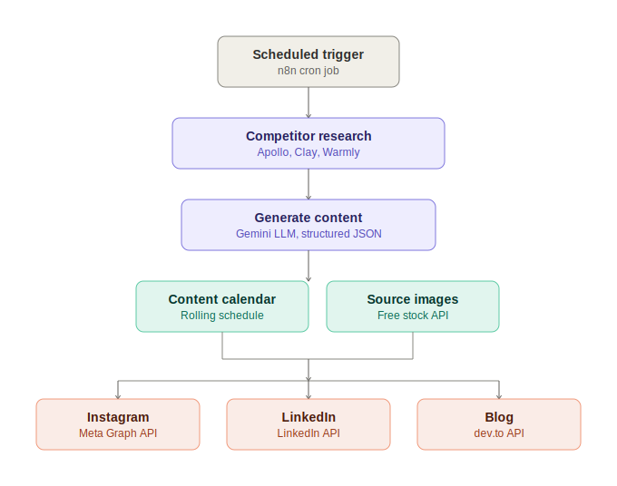
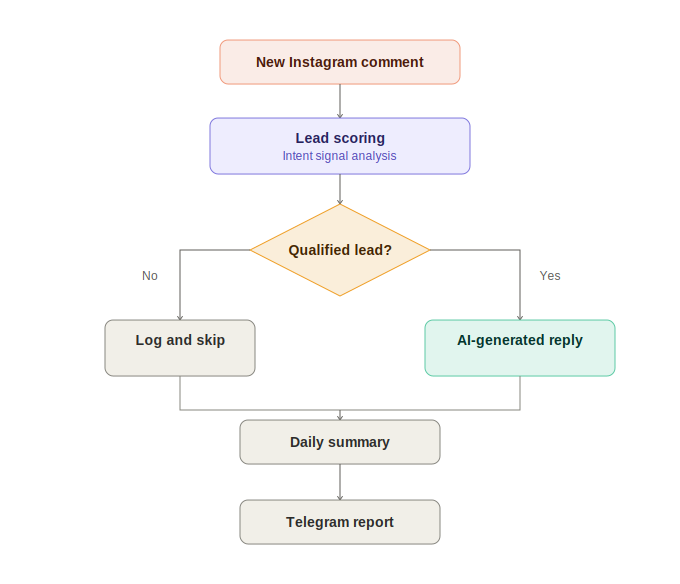
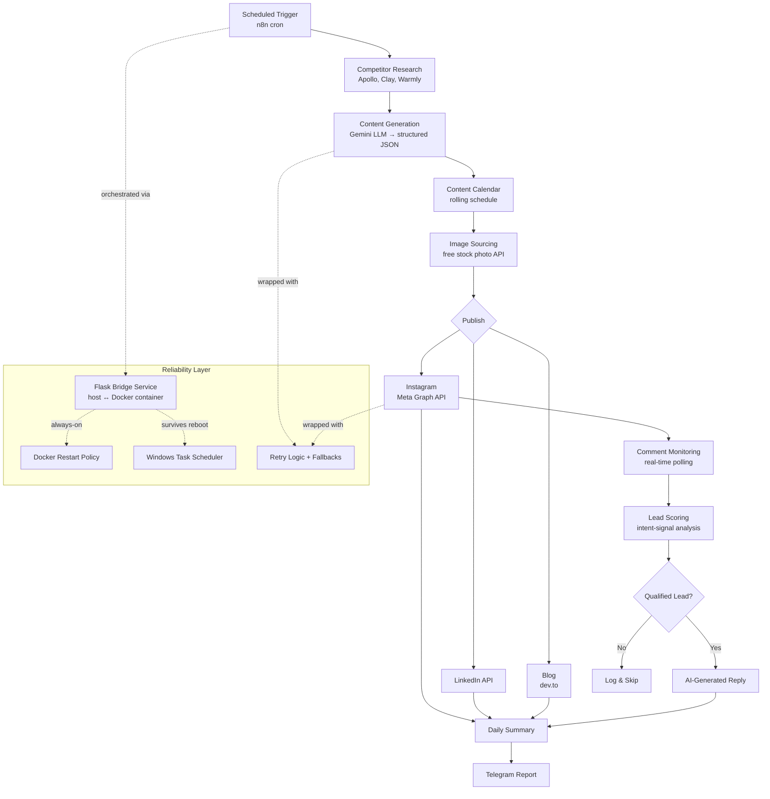

# Workflow

This document details how the LeadQualify Content Agent pipeline runs end to end,
from competitor research to lead engagement.

## Pipeline Diagram

**Part 1 — Content creation and publishing**

**Part 2 — Engagement and reporting**

Mermaid source (single-diagram view)

## Stage-by-Stage Breakdown

### 1. Trigger
n8n (self-hosted in Docker) fires the pipeline on a schedule. Because Docker isolates
the container's filesystem from the host, n8n calls a lightweight **Flask bridge
service** running on the host machine, which is what actually executes the Python
scripts.

### 2. Research
The agent pulls recent content from competitor accounts (Apollo, Clay, Warmly) to
identify what formats and topics are currently performing well in the niche.

### 3. Generate
Research findings are passed to Gemini with a prompt enforcing:
- On-brand voice and tone
- Platform-specific length/format constraints (Instagram vs. LinkedIn vs. blog)
- Structured JSON output, so downstream steps never have to parse free-form text

### 4. Schedule
Generated posts are slotted into a rolling content calendar rather than posted
immediately, so cadence stays consistent even if a generation run produces more or
less content than usual.

### 5. Source Images
Each post is matched with a topically relevant image pulled from a free stock photo
API (Pexels) — a fallback adopted after confirming neither Meta's nor Google's
image-generation options were free at the volume needed.

### 6. Publish
Posts go out automatically via:
- **Meta Graph API** → Instagram
- **LinkedIn API** → LinkedIn
- **dev.to API** → Blog (after Hashnode moved its API behind a paywall mid-project)

### 7. Monitor Engagement
A polling job watches new Instagram comments in near real time.

### 8. Score & Respond
Each comment is scored for buying intent using a lead-scoring algorithm. Comments
that clear the qualification threshold get an AI-generated reply; the rest are
logged and skipped.

### 9. Report
A daily summary — posts published, engagement, leads qualified — is sent via
Telegram, which is the only manual touchpoint in the system.

## Reliability Design

| Concern | Solution |
|---|---|
| Container can't reach host scripts | Flask bridge service exposes an internal API |
| Machine reboots | Docker restart policies (n8n) + Windows Task Scheduler (bridge service) |
| Flaky network calls | Retry logic on all external API calls |
| Partial failures | Fallback logic so the pipeline degrades gracefully instead of failing silently |
| Windows console crashes | Fixed console encoding issues in the bridge service |
| LinkedIn OAuth mismatches | Corrected token/permission scope configuration |

## Permissions & Access Notes

Getting live posting access required working through Meta's layered permission
system: App Roles → Business Portfolio verification → Instagram Tester invitations.
Budget time for this when replicating the pipeline — it's typically the slowest step.
